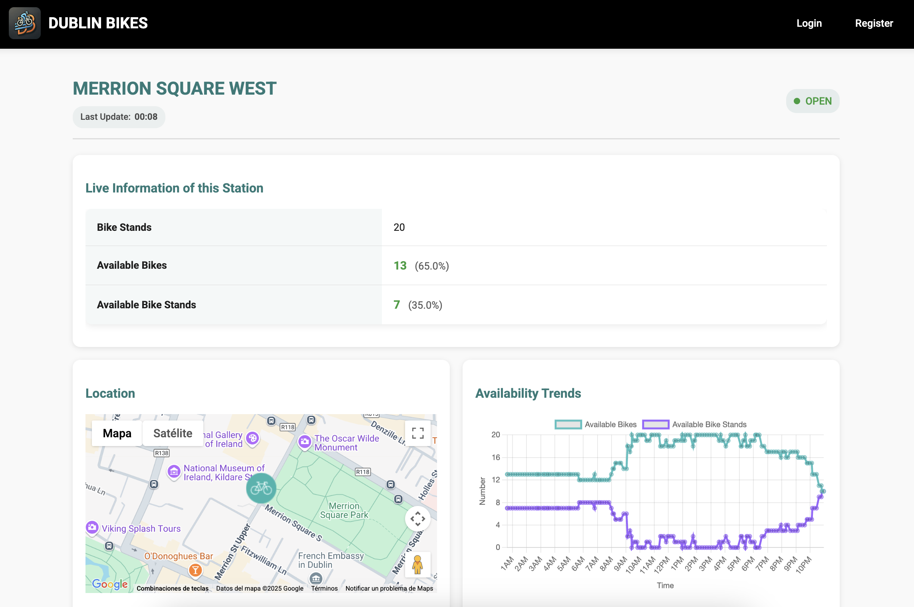

# Dublin Bikes Project

A comprehensive software suite for real-time bike sharing data management, historical analysis, and ride prediction in Dublin. This project integrates data collection, web-serving via Flask, machine learning predictions, and robust SQL database management—all wrapped up in an easy-to-use, modular architecture.

---

## Table of Contents

- [Overview](#overview)
- [Features](#features)
- [Architecture & Directory Structure](#architecture--directory-structure)
- [Modules Breakdown](#modules-breakdown)
  - [DataFrontend](#datafrontend)
  - [DataMining](#datamining)
  - [FlaskApp](#flaskapp)
  - [MachineLearning](#machinelearning)
  - [SqlCode](#sqlcode)
  - [Tests](#tests)
  - [Utils](#utils)
- [Installation](#installation)
- [Usage](#usage)
  - [Running the Web Application](#running-the-web-application)
  - [Data Scraping Modes](#data-scraping-modes)
  - [Machine Learning Predictions](#machine-learning-predictions)
- [Testing](#testing)
- [Makefile Targets](#makefile-targets)
- [Documentation](#documentation)
- [Contributing](#contributing)
- [Team Members and Contributions](#Team-Members-and-Contributions)

---

## Overview

The **Dublin Bikes Project** brings together multiple functionalities for smart bike sharing management. It uses real-time data from the JCDecaux and OpenWeather APIs to provide:
- **Live bike station statuses** and weather updates with caching.
- **Historical data scraping** and storage for predictive analytics.
- **A Flask-based web interface** that shows bike station details, maps with route planning, and ride prediction.
- **Machine learning models** (trained on historical data) to forecast bike availability and dock capacity.

By modularizing the functionalities (data ingestion, web serving, machine learning, and database management), the project is highly flexible, maintainable, and easy to extend.


### Demo

[Youtube Video](https://youtu.be/TNswnZJ8aLs)


### Main Page


### Stations Page



---

## Features

- **Real-time Data Fetching:**  
  Retrieve current bike availability and weather information, with a caching mechanism to avoid excessive API calls.

- **Historical Data Mining:**  
  Concurrent scraping from multiple sources (using threads) to build a historical database.

- **Interactive Web Application:**  
  A Flask app that provides interactive maps, detailed station views, user registration/login, and ride prediction functionality.

- **Predictive Modeling:**  
  Pre-trained machine learning models (one per station) for predicting bike availability and dock status.

- **SQL Database Integration:**  
  Easy-to-manage local SQLite database with scripts to automatically create and update tables.

- **Comprehensive Testing:**  
  Unit and integration tests ensure reliability of data modules, web routes, and business logic.

- **Modular & Reusable Code:**  
  A clear folder structure makes it simple to navigate, extend, or reuse components in other projects.

---

## Architecture & Directory Structure

The repository is organized into several key directories:

```
.
├── DublinBikes
│   ├── DataFrontend          # Modules for data access, caching, and real-time API calls.
│   ├── DataMining            # Modules for scraping and storing historical API data.
│   ├── FlaskApp              # The Flask web application (routes, templates, static files).
│   ├── MachineLearning       # Pre-trained ML models and notebooks for model training.
│   ├── SqlCode               # SQLite database utilities and user management.
│   ├── Tests                 # Unit and integration tests for all modules.
│   ├── Utils                 # Utility scripts and parameters (API keys, settings).
│   ├── data                  # Local data files: CSVs, SQLite database, cache files.
│   └── __init__.py
├── DublinBikes.egg-info
├── README.md                 # This file.
├── aws-flask.pem             # AWS key file (if applicable).
├── docs                      # Documentation files.
│   ├── Developer-Manual.md   # Developer manual with technical details.
│   └── User-Manual.md        # User manual with instructions for end users.
├── makefile                  # Common commands for development and testing.
├── requirements.txt          # Python package requirements.
├── run.py                    # Entrypoint to start the Flask application.
└── setup.py                  # Setup script for packaging.
```

---

## Modules Breakdown

### DataFrontend

- **Purpose:**  
  Provide functions to load bike and weather data from SQL or CSV files and to fetch real-time data from external APIs.  
- **Key Files:**
  - `data_loader_SQL.py`: Queries the SQL database for station details and history.
  - `data_loader_csv.py`: (Legacy) Reads bike station and weather data from CSV files.
  - `data_realtime_bikes.py`: Fetches real-time bike data, employs caching, and saves data to the database.
  - `data_realtime_weather.py`: Retrieves current and forecast weather data with appropriate caching logic.
  - `manage_cache.py`: Cleans outdated records to keep the cache fresh.

### DataMining

- **Purpose:**  
  Collect and store historical bike and weather data by scraping external APIs.  
- **Key Files:**
  - `general_scrapper.py`: Orchestrates scraping of both bikes and weather using threading.
  - `local_scrapping.py`: Utility functions to handle local CSV file storage.
  - `scrapper_jc_decaux.py`: Fetches data from the JCDecaux API for bikes.
  - `scrapper_open_weather.py`: Fetches weather data from the OpenWeather API.

### FlaskApp

- **Purpose:**  
  Hosts the web application that integrates real-time maps, detailed station views, ride prediction, and user authentication.
- **Key Components:**
  - **Routes & App Initialization:**  
    `__init__.py` and `routes.py` initialize the Flask app and define endpoints.
  - **Templates:**  
    Jinja2 HTML files (e.g., `home.html`, `login.html`, `register.html`, `station.html`) which render dynamic pages.
  - **Static Files:**  
    JavaScript (maps, bikes, prediction, weather), CSS (styles.css), and image assets.
  - **User Management:**  
    Integrated user routes for registration, login, profile editing.

### MachineLearning

- **Purpose:**  
  Deploy and train machine learning models for predicting bike availability.
- **Key Files:**
  - `predict_availability.py`: Loads station-specific models and serves predictions via Flask APIs.
  - Jupyter notebooks (`training_part1_model_selection.ipynb` and `training_part2_model_size_reduction.ipynb`) for model experiments and optimization.
  - **Models:**  
    Pre-trained models stored under `pickle_models/`.

### SqlCode

- **Purpose:**  
  Provide core functions for setting up and interacting with the SQLite database.
- **Key Files:**
  - `sql_utils.py`: Contains functions to connect to SQLite, execute SQL commands, and create tables.
  - `user_db.py`: Functions to register users, retrieve user profiles, and update user data.

### Tests

- **Purpose:**  
  Validate the functionality and stability of the entire project.
- **Key Files:**  
  A suite of tests (e.g., `test_current_weather.py`, `test_forecast_weather.py`, `test_manage_cache.py`, `test_realtime_bikes.py`, `test_user_logic.py`, `test_web.py`) that cover data retrieval, caching, API endpoints, user flows, and more.

### Utils

- **Purpose:**  
  Store project-wide parameters such as API keys, URIs, and configuration flags.
- **Key File:**
  - `params.py`

---

## Installation

### Prerequisites

- **Python 3.11.0** 
- **pip** package manager
- On Linux, the Makefile assumes a Debian-based system (for installing build-essential, etc.)

### Steps

1. **Clone the Repository:**

   ```bash
   git clone https://github.com/matiasenrigue/Software-Engineering.git
   cd DublinBikes
   ```

2. **Set Up a Virtual Environment:**

   You can use [pyenv](https://github.com/pyenv/pyenv) along with [pyenv-virtualenv](https://github.com/pyenv/pyenv-virtualenv) or any virtual environment tool:

   ```bash
   # Using pyenv (Makefile target setup also helps with this)
   make setup
   make activate  # Follow the printed instructions to activate the virtualenv
   ```

3. **Install Dependencies:**

   ```bash
   pip install -r requirements.txt
   # Alternatively, install in editable mode:
   pip install -e .
   ```

4. **Set Up the Database:**

   Create the required SQLite tables with:

   ```bash
   make create-db
   ```

---

## Usage

### Running the Web Application

To start the Flask server locally, run:

```bash
python run.py --host=127.0.0.1 --port=5000
```

Or use the provided Makefile target:

```bash
make runserver-local
```

Then open your browser at [http://127.0.0.1:5000/](http://127.0.0.1:5000/).

### Data Scraping Modes

The project supports two modes to refresh historical data:

- **Saving to CSV Files (Default):**

  ```bash
  python DublinBikes/DataMining/general_scrapper.py
  ```

- **Saving Directly to the SQL Database:**

  ```bash
  python DublinBikes/DataMining/general_scrapper.py --save-to-db
  ```

There are also Makefile targets for launching these scripts, such as `scraping-database`.

### Machine Learning Predictions

The ML module uses pre-trained models stored as pickle files for each station. The prediction endpoint (`/api/ride_prediction`) in the Flask app calls the function in `predict_availability.py`. If you wish to update or retrain models, open and run the Jupyter notebooks in `MachineLearning/`.

---

## Testing

Run all unit and integration tests with:

```bash
python -m unittest discover -s DublinBikes/Tests -p "test_*.py"
```

Alternatively, use the Makefile target:

```bash
make runtest
```

The tests cover data retrieval, caching, API responses, and user management flows.

---

## Makefile Targets

A sample Makefile is provided with useful commands such as:

- **`setup`** – Install system dependencies and set up the Python virtual environment.
- **`runserver-local`** – Start the Flask server on your local machine.
- **`runtest`** – Run all tests.
- **`killport`** – Kill any process using the server port (handy during development).

To see all targets, open the Makefile.

---

## Documentation

For comprehensive technical details and user instructions, please refer to the following documents located in the **docs/** folder:

- **Developer Manual:** Detailed technical documentation for developers, including architecture, API details, and extension guidelines. ([docs/Developer-Manual.md](docs/Developer-Manual.md))
- **User Manual:** Instructions for end users on how to use the Dublin Bikes application. ([docs/User-Manual.md](docs/User-Manual.md))

---

## Contributing

Contributions, improvements, and bug fixes are welcome! Please follow these guidelines:

1. Fork the repository and create a new branch for your feature or fix.
2. Ensure that any changes are covered by tests.
3. Update documentation and the README as needed.
4. Submit a pull request with a clear description of your changes.

For major changes, please open an issue to discuss what you would like to change first.

---

## Team Members and Contributions

| Name | Contribution | GitHub Profile |
| -- | -- | -- |
| Matías Enrigue | Python, ML, Testing, JS, SQL, Data, AWS, Project Architecture | [@matiasenrigue](https://github.com/matiasenrigue)   |
| Sofia Hassan | CSS | [@SofiaH08](https://github.com/SofiaH08)  |
| Rupia Begum | Api Keys |[@rupiabd](https://github.com/rupiabd)  |

---

*Happy coding and enjoy exploring the Dublin Bikes Project!*
